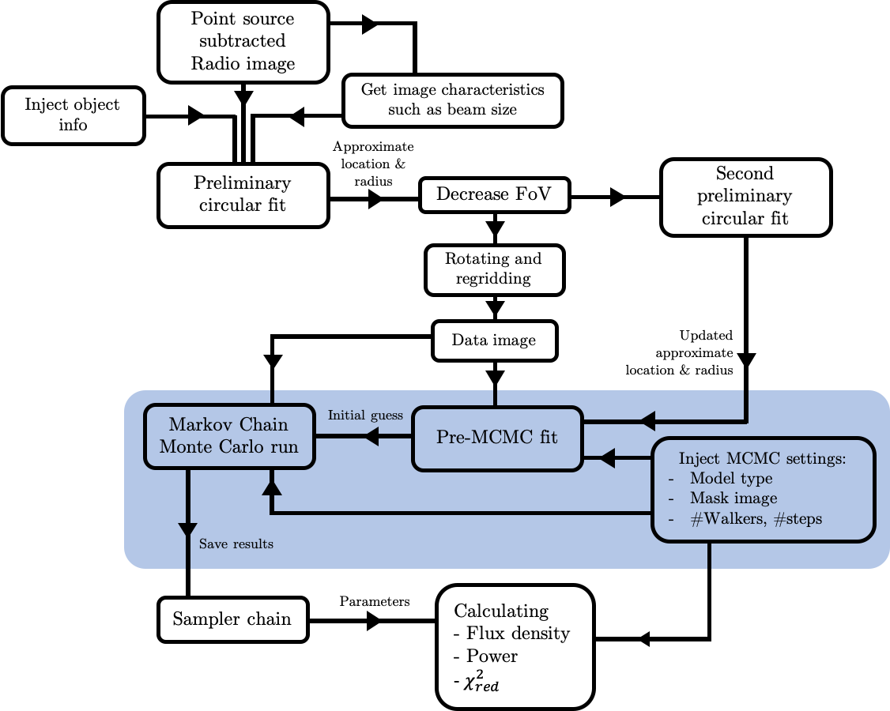

# Halo-FDCa (Flux Density Calculator)

## Introduction
This software pipile is created to automate flux density (and power) estimations of radio halos in galaxy clusters. This is done by fitting the surface brightness profile of halos to a mathematical model using Bayesian Inference. From the resulting fits, the flux density profile can be calculatied analytically. The text below provides a step-by-step example and walk trough of the algorithm as well as a summary of installation and machine requirements. A full text on the methodology can be found under 'Citation'.

This software is open source and still in development. Suggestions, remarks, bugfixes, questions etc. are more than welcome and can be sent to boxelaar@strw.leidenuniv.nl .

### Citation
If you make use of this code in its original form or portions of it, please cite: 
Boxelaar et al., 2020 (in prep.), Astronomy and Computing

Also available on the arXiv: t.b.a.

## Requisites

This software is written in the `Python` programming language and is meant for application in astronomical research. Key software requirements to run the pipeline include:

`Astropy` v4.0 and up 
https://www.astropy.org

`Scipy` v1.5 and up 
`Numpy` v1.19 and up 
`Matplotlib`  
https://www.scipy.org/docs.html

`emcee` v3.0 and up 
https://emcee.readthedocs.io/en/stable/ 

`corner` 
https://corner.readthedocs.io/en/latest/index.html 

This software will run a multithreaded process by default using the `multiprocessing` module. This requires significant computing power and it is advised to use a dedicated external computing mashine. Multithreading can be turned off but this will increase the run time up to a factor 10 (depending on the settings).  

## Algorithm Instructions
### Overview

### Input
The input required to successfully run the algorithm is a standardised astronomical FITS file containing a data image with acompanying header that must include keys standard for radio astronomy (e.g. Observing frequency, sythesised beam information and pixel/sky scale). An optional extra file that can be used as input is a DS9 region file (.reg format) where image subsets can be masked. these regions will be ignored during flux density estimation. Objects and their files can be injected into the puipeline using the 'database.dat' file in /Data/. To run an object, a line in database.dat should look like this:

`cluster_name,/path/to/fits/file.fits,/path/to/region/file.reg`

An arbitraty amound of clusters can be put in this file.

